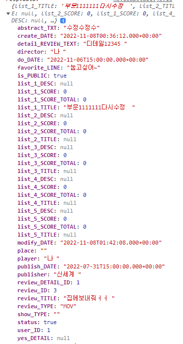

# Error 해결

## 221108 (화)

- postmapping, insertUser로 요청보냈을 때

> 2022-11-08 13:34:03.067  WARN 19992 --- [nio-8080-exec-2] .w.s.m.s.DefaultHandlerExceptionResolver : Resolved [org.springframework.web.method.annotation.MethodArgumentTypeMismatchException: Failed to convert value of type 'java.lang.String' to required type 'int'; nested exception is java.lang.NumberFormatException: For input string: "insert"]

--> 이런.. POST로 보내야하는데 GET으로 보내서 getUser로 요청 들어가서 그런거였음

 

## 에러처리
*** https://bamdule.tistory.com/92

## 221109 (수)

- spring security로 비밀번호 암호화하기
https://seungyooon.tistory.com/245
https://velog.io/@jupiter-j/SpringSecurity-JWT-%EB%A1%9C%EA%B7%B8%EC%9D%B8%EC%8B%9C-401-%EC%97%90%EB%9F%AC

    - 최근에 구현 방식이 변경되어 다수의 블로그에 있는 방식 그대로 적용 어려움
    https://velog.io/@pjh612/Deprecated%EB%90%9C-WebSecurityConfigurerAdapter-%EC%96%B4%EB%96%BB%EA%B2%8C-%EB%8C%80%EC%B2%98%ED%95%98%EC%A7%80

- UserService 파일이 validation 함수들과 같이 있어 너무 길어져서 UserServiceUtil로 별도 클래스 분리
https://okky.kr/articles/508171

- 로그인해야 하는 기능 테스트
    https://shinsunyoung.tistory.com/70
    https://velog.io/@jkijki12/Spring-MockMvc

- VO객체를 api로 리턴 시 필드명이 언더바(_) 앞부분만 소문자로 변형되어 나타남
    
    왜??
    - 필드명 위에 `@JsonProperty("abstract_txt")` 이런 식으로 전부 소문자화한 annotation을 모두 달아주면 소문자로 통일시킬 수 있지만, 필드마다 일일이 달아주기엔 필드가 너무 많음..
    - https://stackoverflow.com/questions/26744885/jackson-objectmapper-upper-lower-case-issues 여기 밑에 있는 답변 중 https://stackoverflow.com/questions/7854030/configuring-objectmapper-in-spring/32842962#32842962 잭슨 configuration class를 이용하는 방식
        - mapper.configure가 deprecated

